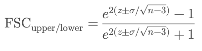
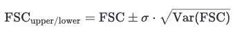
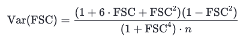
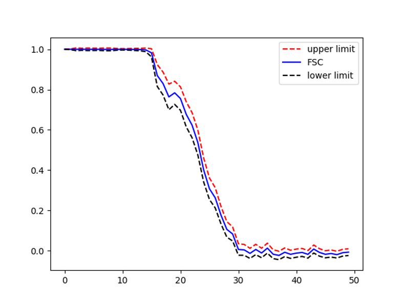

# FSC Error Bar Calculator
 
**About This FSC Confidence Estimation Web App**  
Fourier Shell Correlation (FSC) is the standard method used in the cryo-electron microscopy (cryo-EM) field to estimate the resolution of reconstructed 3D maps, serving as a key indicator of overall map quality. FSC is computed as the cross-correlation coefficient between two independently reconstructed “half maps” as a function of spatial frequency. At each resolution shell, FSC quantifies how well the two maps agree, with higher values indicating better reproducibility and signal.  

However, a single FSC value per shell assumes uniformity in signal quality across all voxels within that shell. In practice, this assumption oversimplifies the reality: voxel intensities vary substantially across different spatial locations, even within the same frequency band. This spatial heterogeneity can arise from anisotropic sampling, preferred particle orientations, or local disorder in the structure.  

To better capture these local variations, this web application computes FSC not just as an average, but includes statistical confidence intervals around each FSC value. This web app allows you to **visualize confidence intervals** around the FSC values using **three different statistical approaches**. You can select your preferred method from the dropdown menu:

#### 1. **Fisher Z-Transform Method** (Default)
This approach assumes the Fisher z-transformed FSC values follow a normal distribution, allowing us to compute analytical confidence bounds.
Formula:  



Where:  

z = 0.5 × log((1 + FSC) / (1 - FSC))
is the Fisher z-transform of the FSC  
n is the number of voxels in the resolution shell  
σ (sigma) is a user-defined z-score (e.g., 1.96 for 95% confidence, 3 for 99.7%)  
By allowing you to set the sigma value, this app gives you flexible control over the statistical stringency of the FSC envelope, helping you better interpret the reliability of FSC-based resolution estimates.  

#### 2. **Bootstrap Method**  
This non-parametric approach resamples voxel pairs within each shell to build a distribution of FSC values. Confidence bounds are calculated from percentiles of this distribution.  

- You can adjust the number of bootstrap samples.  
- The bounds are based on the 2.5th and 97.5th percentiles by default (95% CI).
- 
#### 3. **Variance-Based Method**  
This method estimates FSC uncertainty analytically using a published variance formula that accounts for the number of voxels and the observed FSC value. Confidence bounds are derived as:  



Where Var(FSC) is computed using:  



**Example FSC error bar for EMPIAR 10084 Cryo-EM structure of haemoglobin at 3.2 Å determined with the Volta phase plate**


[Link to the web app](https://fscerrorbar-bpamnw2rerqekapp5veeddq.streamlit.app/)

> **Note:** If your half map files are larger than 200 MB, please download `calcFSC.py` and run it locally on your computer. There is no size limit when using the script locally.

**Run Locally**

1. **Install required packages:**
   ```bash
   pip install streamlit matplotlib numpy mrcfile pandas
   ```

2. **Run the script:**
   ```bash
   streamlit run calcFSC.py
   ```

**References**  
Penczek PA. Resolution measures in molecular electron microscopy. Methods Enzymol. 2010; 482:73–100
PMID: 20888958 | PMCID: PMC3165049

Cardone G, Heymann JB, Steven AC. One number does not fit all: mapping local variations in resolution in cryo-EM reconstructions. J Struct Biol. 2013; 184(2):226–236
PMID: 23954653 | PMCID: PMC3837392

